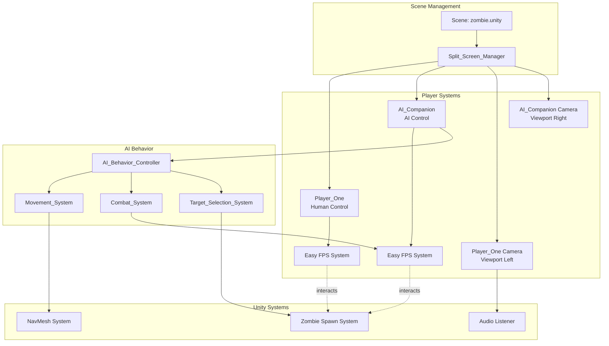
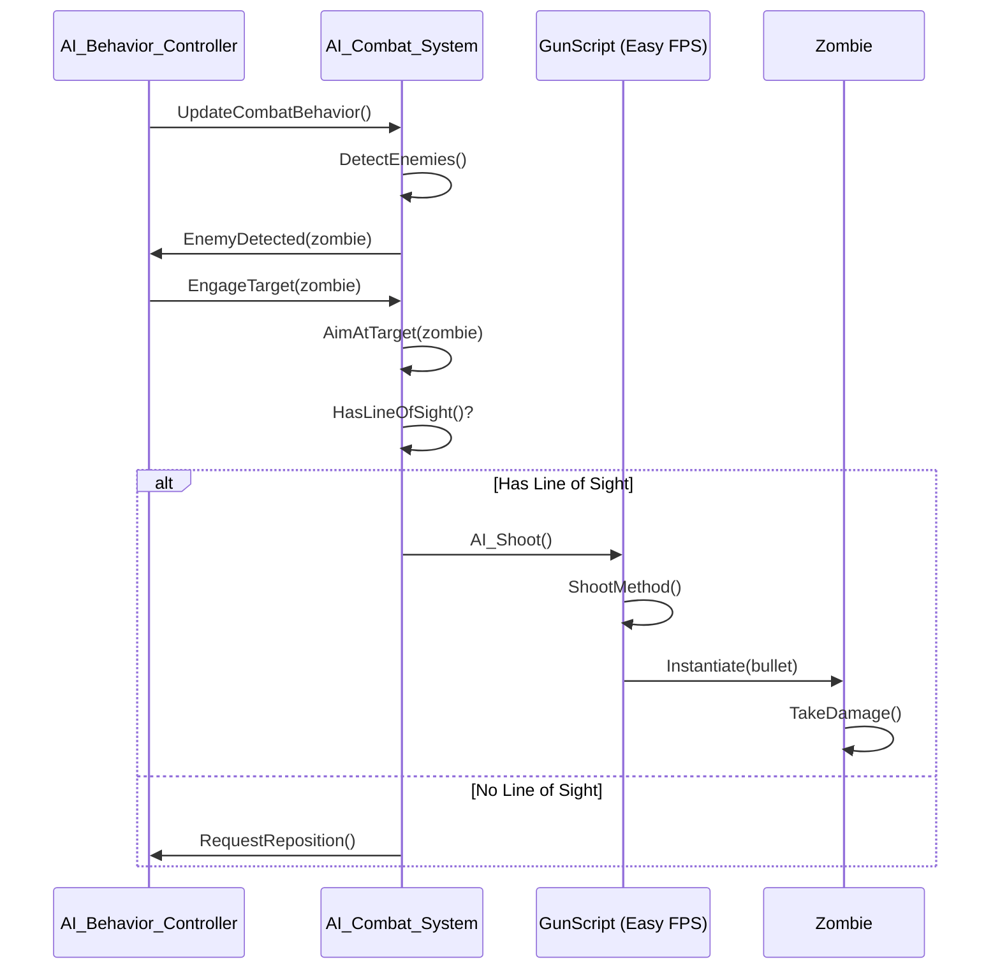

# Design Document: AI Companion Split-Screen System

## Overview

Este documento describe el diseño técnico para implementar un sistema de pantalla dividida (split-screen) con un compañero controlado por IA en el juego FPS de zombies de Unity. El sistema permitirá que dos jugadores (uno humano y uno IA) compartan la misma escena con vistas de cámara independientes, donde el compañero IA ayudará activamente al jugador principal en el combate contra zombies.

### Objetivos del Diseño

- Implementar un sistema de split-screen vertical que divida la pantalla en dos viewports iguales
- Crear un compañero IA que utilice el sistema Easy FPS existente para disparar
- Implementar comportamiento de IA basado en NavMesh para movimiento inteligente
- Integrar el sistema sin romper la funcionalidad existente del juego
- Mantener rendimiento aceptable con dos cámaras activas

### Alcance

**Incluido:**
- Sistema de gestión de split-screen (Split_Screen_Manager)
- Comportamiento de IA para movimiento, combate y selección de objetivos
- Configuración de cámaras y viewports
- Sistema de audio para el compañero IA
- Integración con Easy FPS System existente

**Excluido:**
- Modificaciones al sistema de zombies existente
- Cambios a la interfaz de usuario principal
- Sistema de red/multijugador online
- Personalización del compañero IA por el jugador

## Architecture

### Diagrama de Arquitectura del Sistema



### Patrones de Diseño

**1. Manager Pattern (Split_Screen_Manager)**
- Responsable de inicializar y coordinar todos los componentes del sistema
- Gestiona el ciclo de vida de ambos jugadores
- Configura las cámaras y viewports

**2. State Machine Pattern (AI_Behavior_Controller)**
- Estados: Idle, Following, Combat, Retreating
- Transiciones basadas en distancia a enemigos y salud

**3. Strategy Pattern (Target_Selection_System)**
- Diferentes estrategias de selección de objetivos
- Priorización basada en amenaza, distancia y contexto

## Components and Interfaces

### 1. Split_Screen_Manager

**Responsabilidad:** Gestionar la configuración de split-screen y la inicialización de ambos jugadores.

**Propiedades:**
```csharp
public class Split_Screen_Manager : MonoBehaviour
{
    [Header("Player References")]
    public GameObject playerOnePrefab;
    public GameObject aiCompanionPrefab;
    public Transform playerOneSpawnPoint;
    public Transform aiCompanionSpawnPoint;
    
    [Header("Camera Configuration")]
    public float fieldOfView = 17.4f;
    public LayerMask cullingMask;
    
    [Header("Spawn Settings")]
    public float minSpawnDistance = 2f;
    public Vector3 aiSpawnOffset = new Vector3(2f, 0f, 0f);
    
    private GameObject playerOneInstance;
    private GameObject aiCompanionInstance;
    private Camera playerOneCamera;
    private Camera aiCompanionCamera;
}
```

**Métodos Públicos:**
```csharp
// Inicializa el sistema de split-screen
public void InitializeSplitScreen()

// Configura los viewports de las cámaras
public void ConfigureCameraViewports()

// Instancia ambos jugadores en la escena
public void SpawnPlayers()

// Limpia y reinicia el sistema
public void ResetSplitScreen()
```

**Interfaz de Inicialización:**
- Se ejecuta en `Start()` de la escena zombie.unity
- Orden de inicialización: Spawn Players → Configure Cameras → Initialize AI

### 2. AI_Behavior_Controller

**Responsabilidad:** Controlar el comportamiento general del compañero IA.

**Propiedades:**
```csharp
public class AI_Behavior_Controller : MonoBehaviour
{
    [Header("References")]
    public Transform playerOne;
    public NavMeshAgent navAgent;
    public GunScript gunScript;
    
    [Header("Behavior Settings")]
    public float updateInterval = 0.2f;
    public float combatRange = 15f;
    public float followDistance = 4f;
    public float followDistanceMax = 5f;
    
    [Header("Health")]
    public float maxHealth = 100f;
    public float currentHealth = 100f;
    public float lowHealthThreshold = 30f;
    
    private AIState currentState;
    private float lastUpdateTime;
}
```

**Estados (AIState enum):**
```csharp
public enum AIState
{
    Idle,           // Sin objetivos, esperando
    Following,      // Siguiendo al jugador principal
    Combat,         // En combate con zombies
    Retreating      // Salud baja, retrocediendo
}
```

**Métodos Públicos:**
```csharp
// Actualiza el estado de la IA
public void UpdateAIState()

// Recibe daño de enemigos
public void TakeDamage(float damage)

// Obtiene el estado actual
public AIState GetCurrentState()

// Fuerza un cambio de estado
public void SetState(AIState newState)
```

### 3. AI_Movement_System

**Responsabilidad:** Gestionar el movimiento del compañero IA usando NavMesh.

**Propiedades:**
```csharp
public class AI_Movement_System : MonoBehaviour
{
    [Header("References")]
    public NavMeshAgent navAgent;
    public Transform playerOne;
    public Transform currentTarget;
    
    [Header("Movement Settings")]
    public float moveSpeed = 3.5f;
    public float rotationSpeed = 5f;
    public float stoppingDistance = 2f;
    public float combatPositionDistance = 10f;
    
    private Vector3 lastDestination;
}
```

**Métodos Públicos:**
```csharp
// Mueve el IA hacia el jugador principal
public void FollowPlayer()

// Mueve el IA a una posición de combate óptima
public void MoveToCombaPosition(Transform target)

// Detiene el movimiento
public void StopMovement()

// Rota hacia un objetivo
public void LookAtTarget(Transform target)

// Verifica si el destino es alcanzable
public bool IsDestinationReachable(Vector3 destination)
```

### 4. AI_Combat_System

**Responsabilidad:** Gestionar el comportamiento de combate del compañero IA.

**Propiedades:**
```csharp
public class AI_Combat_System : MonoBehaviour
{
    [Header("References")]
    public GunScript gunScript;
    public Transform firePoint;
    public LayerMask enemyLayer;
    
    [Header("Combat Settings")]
    public float detectionRange = 15f;
    public float fireRateMin = 0.5f;
    public float fireRateMax = 1.0f;
    public float aimAccuracy = 0.9f;
    
    private float nextFireTime;
    private Transform currentTarget;
    private bool canShoot;
}
```

**Métodos Públicos:**
```csharp
// Dispara al objetivo actual
public void ShootAtTarget()

// Verifica si hay línea de visión al objetivo
public bool HasLineOfSight(Transform target)

// Apunta hacia el objetivo
public void AimAtTarget(Transform target)

// Verifica si puede disparar
public bool CanShoot()
```

### 5. AI_Target_Selection_System

**Responsabilidad:** Seleccionar objetivos de forma inteligente basándose en prioridades.

**Propiedades:**
```csharp
public class AI_Target_Selection_System : MonoBehaviour
{
    [Header("References")]
    public Transform playerOne;
    public Transform aiTransform;
    
    [Header("Selection Settings")]
    public float scanInterval = 0.3f;
    public float threatRadius = 15f;
    public float playerThreatRadius = 5f;
    public LayerMask zombieLayer;
    
    private List<Transform> detectedEnemies;
    private Transform currentTarget;
    private float lastScanTime;
}
```

**Métodos Públicos:**
```csharp
// Escanea enemigos en el área
public void ScanForEnemies()

// Selecciona el mejor objetivo basado en prioridades
public Transform SelectBestTarget()

// Calcula la prioridad de amenaza de un enemigo
public float CalculateThreatPriority(Transform enemy)

// Obtiene el objetivo actual
public Transform GetCurrentTarget()

// Limpia el objetivo actual
public void ClearTarget()
```

**Algoritmo de Priorización:**
1. Zombies a menos de 5 unidades de Player_One (prioridad máxima)
2. Zombies más cercanos al AI_Companion
3. Zombies con línea de visión clara
4. Zombies no atacados actualmente por Player_One

## Data Models

### AIStateData

Estructura para almacenar el estado completo del compañero IA:

```csharp
[System.Serializable]
public struct AIStateData
{
    public AIState currentState;
    public float health;
    public Vector3 position;
    public Quaternion rotation;
    public Transform currentTarget;
    public float lastStateChangeTime;
    public bool isMoving;
    public bool isShooting;
}
```

### CameraConfiguration

Estructura para configuración de cámaras:

```csharp
[System.Serializable]
public struct CameraConfiguration
{
    public Rect viewport;
    public int depth;
    public float fieldOfView;
    public LayerMask cullingMask;
    public bool hasAudioListener;
}
```

### TargetPriority

Estructura para evaluación de objetivos:

```csharp
[System.Serializable]
public struct TargetPriority
{
    public Transform target;
    public float distanceToAI;
    public float distanceToPlayer;
    public float threatScore;
    public bool hasLineOfSight;
    public bool isBeingAttackedByPlayer;
}
```

## Testing Strategy

Dado que este feature involucra principalmente configuración de Unity, integración de sistemas existentes, y comportamiento de IA basado en NavMesh, **property-based testing NO es apropiado**. En su lugar, utilizaremos:

### 1. Unit Tests

**AI_Target_Selection_System:**
- Test: Selección del zombie más cercano cuando hay múltiples enemigos
- Test: Priorización de zombies cerca del jugador principal
- Test: Ignorar zombies sin línea de visión
- Test: Cambio de objetivo cuando aparece mayor amenaza

**AI_Behavior_Controller:**
- Test: Transición de estado Following → Combat cuando detecta enemigo
- Test: Transición de estado Combat → Retreating cuando salud < 30
- Test: Transición de estado Retreating → Following cuando salud se recupera
- Test: Estado Idle cuando no hay jugador principal

**AI_Combat_System:**
- Test: Cálculo correcto del intervalo de disparo (0.5-1.0s)
- Test: Verificación de línea de visión con raycast
- Test: No disparar cuando está en movimiento rápido

### 2. Integration Tests

**Split_Screen_Manager:**
- Test: Inicialización correcta de ambos jugadores en la escena
- Test: Configuración de viewports (izquierdo: 0-0.5, derecho: 0.5-1.0)
- Test: Asignación correcta de Audio Listener solo en Player_One
- Test: Ambas cámaras renderizan simultáneamente

**AI_Movement_System + NavMesh:**
- Test: AI sigue al jugador manteniendo distancia 3-5 unidades
- Test: AI navega alrededor de obstáculos usando NavMesh
- Test: AI se mueve a posición de combate cuando detecta enemigo
- Test: AI se detiene cuando alcanza destino

**AI + Easy FPS System:**
- Test: AI dispara correctamente usando GunScript
- Test: Balas del AI causan daño a zombies
- Test: Sonidos de disparo se reproducen correctamente
- Test: Animaciones de disparo se ejecutan

### 3. Manual/Automated UI Tests

**Split-Screen Rendering:**
- Test: Ambos viewports muestran contenido correcto
- Test: No hay overlap entre viewports
- Test: Relación de aspecto correcta en cada viewport
- Test: Field of view consistente (17.4) en ambas cámaras

**Performance Tests:**
- Test: Framerate mínimo de 30 FPS con ambas cámaras activas
- Test: Occlusion culling funciona en ambas cámaras
- Test: Actualización de IA cada 0.2s no causa lag

### 4. Scenario-Based Tests

**Escenario 1: Inicio de Juego**
- Given: Escena zombie.unity se carga
- When: Split_Screen_Manager se inicializa
- Then: Player_One aparece en spawn point
- And: AI_Companion aparece a 2+ unidades de Player_One
- And: Ambas cámaras están activas con viewports correctos

**Escenario 2: AI Siguiendo al Jugador**
- Given: No hay zombies en el área
- When: Player_One se mueve
- Then: AI_Companion sigue manteniendo distancia 3-5 unidades
- And: AI_Companion rota hacia la dirección de movimiento

**Escenario 3: Combate Cooperativo**
- Given: Múltiples zombies aparecen
- When: Zombies están dentro de 15 unidades
- Then: AI_Companion selecciona el zombie más cercano a Player_One
- And: AI_Companion dispara con intervalos de 0.5-1.0s
- And: AI_Companion mantiene línea de visión con el objetivo

**Escenario 4: AI con Salud Baja**
- Given: AI_Companion tiene salud < 30
- When: Zombies están cerca
- Then: AI_Companion entra en estado Retreating
- And: AI_Companion mantiene distancia de los zombies
- And: AI_Companion continúa disparando mientras retrocede

### Test Configuration

**Herramientas:**
- Unity Test Framework para unit tests
- Play Mode tests para integration tests
- Manual testing para UI y performance

**Cobertura Objetivo:**
- Unit tests: 80%+ de lógica de IA
- Integration tests: Todos los flujos principales
- Scenario tests: Todos los requisitos de aceptación

## Error Handling

### 1. Errores de Inicialización

**Problema:** Player_One no existe en la escena
```csharp
if (playerOneInstance == null)
{
    Debug.LogError("[Split_Screen_Manager] Player_One no encontrado. Abortando inicialización.");
    enabled = false;
    return;
}
```

**Problema:** NavMesh no está configurado
```csharp
if (!NavMesh.SamplePosition(aiSpawnPoint.position, out NavMeshHit hit, 5f, NavMesh.AllAreas))
{
    Debug.LogError("[AI_Movement_System] NavMesh no encontrado en la posición de spawn del AI.");
    // Intentar spawn en posición alternativa
    TryAlternativeSpawnPosition();
}
```

### 2. Errores de Runtime

**Problema:** AI pierde referencia a Player_One
```csharp
private void ValidatePlayerReference()
{
    if (playerOne == null)
    {
        playerOne = GameObject.FindGameObjectWithTag("Player")?.transform;
        if (playerOne == null)
        {
            Debug.LogWarning("[AI_Behavior_Controller] Player_One no encontrado. Entrando en estado Idle.");
            SetState(AIState.Idle);
        }
    }
}
```

**Problema:** NavMesh path no es alcanzable
```csharp
public void SetDestination(Vector3 destination)
{
    NavMeshPath path = new NavMeshPath();
    if (navAgent.CalculatePath(destination, path))
    {
        if (path.status == NavMeshPathStatus.PathComplete)
        {
            navAgent.SetPath(path);
        }
        else
        {
            Debug.LogWarning($"[AI_Movement_System] Path incompleto hacia {destination}. Buscando alternativa.");
            FindAlternativeDestination(destination);
        }
    }
}
```

### 3. Errores de Combate

**Problema:** GunScript no está configurado
```csharp
private void ValidateGunScript()
{
    if (gunScript == null)
    {
        gunScript = GetComponentInChildren<GunScript>();
        if (gunScript == null)
        {
            Debug.LogError("[AI_Combat_System] GunScript no encontrado. Combate deshabilitado.");
            enabled = false;
        }
    }
}
```

**Problema:** Objetivo se destruye durante combate
```csharp
private void UpdateTarget()
{
    if (currentTarget == null || !currentTarget.gameObject.activeInHierarchy)
    {
        Debug.Log("[AI_Combat_System] Objetivo perdido. Buscando nuevo objetivo.");
        currentTarget = targetSelectionSystem.SelectBestTarget();
    }
}
```

### 4. Errores de Cámara

**Problema:** Múltiples Audio Listeners detectados
```csharp
private void ConfigureAudioListeners()
{
    AudioListener[] listeners = FindObjectsOfType<AudioListener>();
    if (listeners.Length > 1)
    {
        Debug.LogWarning($"[Split_Screen_Manager] {listeners.Length} Audio Listeners detectados. Deshabilitando extras.");
        foreach (AudioListener listener in listeners)
        {
            if (listener.gameObject != playerOneCamera.gameObject)
            {
                listener.enabled = false;
            }
        }
    }
}
```

### 5. Estrategias de Recuperación

**Fallback para NavMesh:**
- Si el path falla, intentar destino más cercano válido
- Si persiste, usar movimiento directo sin NavMesh temporalmente

**Fallback para Target Selection:**
- Si no hay objetivos válidos, volver a estado Following
- Si Player_One no existe, entrar en estado Idle

**Fallback para Combate:**
- Si GunScript falla, registrar error pero mantener movimiento
- Si munición se agota, intentar recargar automáticamente

## Integration with Easy FPS System

### Modificaciones Necesarias

**1. GunScript.cs**

El sistema Easy FPS actual está diseñado para control de jugador humano. Necesitamos agregar soporte para control por IA:

```csharp
// Agregar al GunScript.cs
[Header("AI Control")]
public bool isAIControlled = false;

// Método público para que la IA dispare
public void AI_Shoot()
{
    if (isAIControlled && !reloading && bulletsInTheGun > 0)
    {
        ShootMethod();
    }
}

// Método público para que la IA recargue
public void AI_Reload()
{
    if (isAIControlled && bulletsIHave > 0 && bulletsInTheGun < amountOfBulletsPerLoad)
    {
        StartCoroutine("Reload_Animation");
    }
}
```

**2. MouseLookScript.cs**

Deshabilitar el control de mouse para el AI_Companion:

```csharp
// Modificar en MouseLookScript.cs
void Awake()
{
    // Solo bloquear cursor si es jugador humano
    if (gameObject.CompareTag("Player"))
    {
        Cursor.lockState = CursorLockMode.Locked;
    }
    myCamera = GameObject.FindGameObjectWithTag("MainCamera").transform;
}

void MouseInputMovement()
{
    // Solo procesar input si no es IA
    if (!GetComponent<AI_Behavior_Controller>())
    {
        wantedYRotation += Input.GetAxis("Mouse X") * mouseSensitvity;
        wantedCameraXRotation -= Input.GetAxis("Mouse Y") * mouseSensitvity;
        wantedCameraXRotation = Mathf.Clamp(wantedCameraXRotation, bottomAngleView, topAngleView);
    }
}
```

**3. PlayerMovementScript.cs**

Deshabilitar el control de teclado para el AI_Companion:

```csharp
// Modificar en PlayerMovementScript.cs
void PlayerMovementLogic()
{
    // Solo aplicar input si no es IA
    bool isAI = GetComponent<AI_Behavior_Controller>() != null;
    
    if (!isAI && grounded)
    {
        rb.AddRelativeForce(
            Input.GetAxis("Horizontal") * accelerationSpeed * Time.deltaTime, 
            0, 
            Input.GetAxis("Vertical") * accelerationSpeed * Time.deltaTime
        );
    }
    // El movimiento del IA será controlado por NavMeshAgent
}
```

### Configuración del Prefab AI_Companion

El prefab del AI_Companion será una copia del prefab Player con los siguientes cambios:

**Componentes a Agregar:**
- `AI_Behavior_Controller`
- `AI_Movement_System`
- `AI_Combat_System`
- `AI_Target_Selection_System`
- `NavMeshAgent`

**Componentes a Modificar:**
- `GunScript`: Establecer `isAIControlled = true`
- `MouseLookScript`: Deshabilitar input de mouse
- `PlayerMovementScript`: Deshabilitar input de teclado
- `Camera`: Configurar viewport derecho

**Componentes a Remover:**
- `AudioListener` (solo Player_One lo tiene)

### Flujo de Integración



## Performance Optimization

### 1. Actualización de IA

**Problema:** Actualizar la IA cada frame es costoso.

**Solución:** Usar actualización por intervalos:

```csharp
private float updateInterval = 0.2f;
private float lastUpdateTime;

void Update()
{
    if (Time.time - lastUpdateTime >= updateInterval)
    {
        UpdateAILogic();
        lastUpdateTime = Time.time;
    }
}
```

### 2. Cálculo de NavMesh

**Problema:** Calcular paths cada frame es costoso.

**Solución:** Calcular paths de forma asíncrona y cachear resultados:

```csharp
private Coroutine pathCalculationCoroutine;

public void RequestPath(Vector3 destination)
{
    if (pathCalculationCoroutine != null)
    {
        StopCoroutine(pathCalculationCoroutine);
    }
    pathCalculationCoroutine = StartCoroutine(CalculatePathAsync(destination));
}

private IEnumerator CalculatePathAsync(Vector3 destination)
{
    NavMeshPath path = new NavMeshPath();
    navAgent.CalculatePath(destination, path);
    yield return null; // Esperar un frame
    
    if (path.status == NavMeshPathStatus.PathComplete)
    {
        navAgent.SetPath(path);
    }
}
```

### 3. Detección de Enemigos

**Problema:** Usar `FindObjectsOfType` cada frame es muy costoso.

**Solución:** Usar Physics.OverlapSphere con caching:

```csharp
private Collider[] enemyBuffer = new Collider[20];
private float scanInterval = 0.3f;

public void ScanForEnemies()
{
    int numEnemies = Physics.OverlapSphereNonAlloc(
        transform.position,
        threatRadius,
        enemyBuffer,
        zombieLayer
    );
    
    detectedEnemies.Clear();
    for (int i = 0; i < numEnemies; i++)
    {
        detectedEnemies.Add(enemyBuffer[i].transform);
    }
}
```

### 4. Occlusion Culling

**Configuración:** Habilitar occlusion culling para ambas cámaras:

```csharp
private void ConfigureCameraOptimizations()
{
    playerOneCamera.useOcclusionCulling = true;
    aiCompanionCamera.useOcclusionCulling = true;
    
    // Reducir distancia de renderizado si es necesario
    playerOneCamera.farClipPlane = 100f;
    aiCompanionCamera.farClipPlane = 100f;
}
```

### 5. LOD (Level of Detail)

**Recomendación:** Asegurar que los modelos de zombies y entorno usen LOD:

```csharp
// Verificar que los modelos tengan LODGroup configurado
private void ValidateLODConfiguration()
{
    LODGroup[] lodGroups = FindObjectsOfType<LODGroup>();
    if (lodGroups.Length == 0)
    {
        Debug.LogWarning("[Performance] No se encontraron LODGroups. Considerar agregar LOD a los modelos.");
    }
}
```

### 6. Métricas de Rendimiento

**Objetivos:**
- Framerate mínimo: 30 FPS
- Tiempo de actualización de IA: < 5ms por frame
- Tiempo de cálculo de path: < 10ms
- Memoria adicional: < 50MB

**Monitoreo:**
```csharp
#if UNITY_EDITOR
private void OnGUI()
{
    GUILayout.Label($"FPS: {1f / Time.deltaTime:F1}");
    GUILayout.Label($"AI Update Time: {aiUpdateTime:F2}ms");
    GUILayout.Label($"Active Enemies: {detectedEnemies.Count}");
}
#endif
```

## Conclusión

Este diseño proporciona una arquitectura modular y extensible para implementar el sistema de split-screen con compañero IA. Los componentes están claramente separados por responsabilidades, facilitando el testing y mantenimiento. La integración con el sistema Easy FPS existente se realiza de forma no invasiva, preservando la funcionalidad actual del juego.

### Próximos Pasos

1. Implementar `Split_Screen_Manager` y configuración de cámaras
2. Crear prefab `AI_Companion` basado en Player existente
3. Implementar `AI_Behavior_Controller` con máquina de estados
4. Implementar `AI_Movement_System` con NavMesh
5. Implementar `AI_Combat_System` y `AI_Target_Selection_System`
6. Integrar con Easy FPS System
7. Configurar NavMesh en la escena zombie.unity
8. Testing y optimización de rendimiento

### Riesgos y Mitigaciones

**Riesgo:** Rendimiento insuficiente con dos cámaras
**Mitigación:** Implementar occlusion culling, LOD, y reducir distancia de renderizado

**Riesgo:** NavMesh no configurado correctamente
**Mitigación:** Documentar proceso de baking de NavMesh, incluir validación en tiempo de ejecución

**Riesgo:** Conflictos con Easy FPS System
**Mitigación:** Modificaciones mínimas y no invasivas, usar flags para diferenciar IA de jugador humano

**Riesgo:** Audio Listener múltiple causa problemas
**Mitigación:** Validación automática y deshabilitación de listeners extras en Split_Screen_Manager
